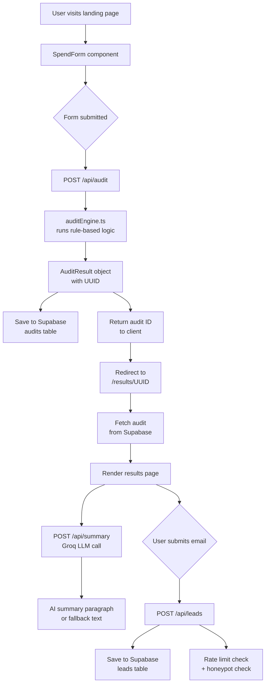

# Architecture

## System Diagram

## Data Flow: Input → Audit Result

1. **User fills form** — selects tools, enters plan/spend/seats, sets team size and use case. State persists in `localStorage` so a page reload doesn't lose their data.

2. **POST /api/audit** — Next.js API route receives the `FormData` object. No authentication required.

3. **auditEngine.ts** — Pure TypeScript function. Takes `FormData`, runs a switch statement per tool. Each tool case evaluates: is the user on the right plan? Is there a cheaper same-vendor option? Is there a cheaper alternative for their use case? Returns a `ToolAuditResult` per tool with `monthlySavings`, `severity`, `reason`, and `recommendedAction`.

4. **AuditResult object** — Assembled with a UUID, timestamp, the form data, all tool results, and rolled-up totals. Saved to Supabase `audits` table with the UUID as primary key.

5. **Results page** — Client fetches the audit by UUID from Supabase. Simultaneously fires a POST to `/api/summary` with the audit data to generate the Groq AI summary. Results render immediately; summary fills in asynchronously.

6. **Lead capture** — Email form on the results page POSTs to `/api/leads`. Rate-limited per IP (3 submissions/hour), honeypot field rejects bots silently. Saved to `leads` table with `is_high_savings` flag for Credex follow-up prioritization.

## Why Next.js

- **One deployment** — API routes and frontend in a single Vercel deployment. No separate Express server to manage.
- **File-based routing** — `/results/[id]` just works. Dynamic routes without any router config.
- **TypeScript first-class** — The entire codebase is typed. `FormData`, `AuditResult`, `ToolAuditResult` are all shared types between the frontend and API routes.
- **Vercel deploy is one command** — For a 7-day project, zero-config deployment matters.

Considered Vue + Nuxt but chose Next.js because of stronger TypeScript ecosystem and familiarity from my internship at LabelLift.

## Why Supabase

- Free tier handles thousands of rows
- Postgres gives us real querying if we need to analyze lead data later
- SDK is straightforward — `supabaseAdmin.from('leads').insert({...})` reads like English
- Row-level security is built in if we need to add user auth later

## Why Groq (not Anthropic API directly)

The assignment preferred Anthropic API but I don't have API credits. Groq provides free access to Llama 3.1 with an OpenAI-compatible API. The prompt is model-agnostic — swapping to `claude-sonnet-4-20250514` requires changing one line.

## What I'd change for 10k audits/day

**Current bottleneck**: The Supabase free tier has connection limits. At 10k audits/day (~7 audits/minute peak), we'd hit connection pool limits within days.

**Changes needed**:

1. **Connection pooling** — Add Supabase's PgBouncer or switch to Neon with serverless driver. This handles connection limits without changing application code.

2. **Cache popular audit patterns** — Most users pick from a small set of common tool combinations (Cursor Pro + Claude Pro + GitHub Copilot Individual). These produce identical audit results. Add a Redis cache keyed on the sorted tool combination hash. Cache hit rate would likely be 40%+ after day 1.

3. **Queue the AI summary** — Currently the summary call is synchronous. At scale, move it to a background queue (Upstash QStash) and push the result to the client via SSE. This stops Groq rate limits from slowing down the results page.

4. **CDN for results pages** — Results are read-only after creation. Add `Cache-Control: public, max-age=3600` headers and let Vercel's CDN serve them. The audit UUID makes cache invalidation trivial.

5. **Rate limiting at edge** — Move rate limiting from in-memory (resets on cold starts) to Upstash Redis at the Vercel edge. Current in-memory rate limiter doesn't survive serverless function restarts.